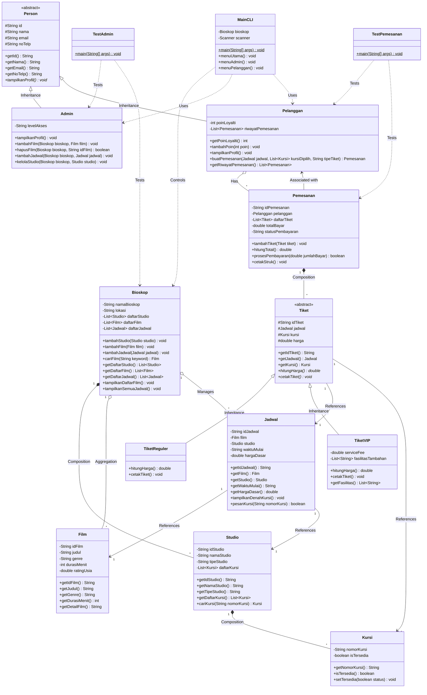

# Sistem Pemesanan Tiket Bioskop (OOP Java)

Aplikasi konsol interaktif berbasis Java yang mengimplementasikan prinsip-prinsip Pemrograman Berorientasi Objek (OOP) untuk mensimulasikan sistem bioskop lengkap. Aplikasi ini mencakup antarmuka baris perintah (CLI) untuk manajemen bioskop oleh admin serta alur pemesanan tiket oleh pelanggan.

---

## 📌 Fitur Utama

* **Antarmuka Interaktif CLI (`MainCLI`):**
  * Menu navigasi utama untuk login/peran Admin dan Pelanggan.
* **Manajemen Peran Pengguna (User Management):**
  * **Admin:** Mengelola data film, jadwal tayang, dan studio bioskop.
  * **Pelanggan:** Memilih jadwal tayang film, memilih kursi studio, melakukan pemesanan tiket, serta melihat struk transaksi dan riwayat pesanan.
* **Manajemen Bioskop & Studio:**
  * Pengelompokan bioskop berdasarkan studio, denah kursi, dan jadwal penayangan.
  * Pengecekan ketersediaan kursi secara dinamis saat pemilihan kursi berlangsung.
* **Sistem Tiket & Transaksi:**
  * Polimorfisme tiket melalui **Tiket Reguler** dan **Tiket VIP** (dengan fasilitas dan biaya tambahan).
  * Kalkulasi total pembayaran, status transaksi, dan pencetakan struk.

---

## 🏛️ Penerapan Konsep OOP

1. **Inheritance (Pewarisan):**
   * `Person` sebagai superclass yang diturunkan ke `Admin` dan `Pelanggan`.
   * `Tiket` sebagai superclass yang diturunkan ke `TiketReguler` dan `TiketVIP`.
2. **Polymorphism (Polimorfisme):**
   * Implementasi method `hitungHarga()` dan `cetakTiket()` yang memiliki perilaku berbeda pada `TiketReguler` dan `TiketVIP`.
3. **Encapsulation (Enkapsulasi):**
   * Semua variabel instans dikontrol menggunakan visibility modifier (`private` / `protected`) dan diakses melalui metode `getter` dan `setter`.
4. **Abstraction (Abstraksi):**
   * Pembuatan kelas abstrak (`Person`, `Tiket`) sebagai cetak biru fungsionalitas yang wajib diimplementasikan oleh kelas turunan.

---

## 📊 Class Diagram



---

## 📂 Struktur Proyek

```
oop-project-bioskop/
├── src/
│   ├── main/
│   │   ├── MainCLI.java            # Entry point antarmuka interaktif CLI
│   │   ├── TestAdmin.java          # Kelas pengujian fungsionalitas Admin
│   │   └── TestPemesanan.java      # Kelas pengujian transaksi pemesanan
│   └── model/
│       ├── bioskop/
│       │   ├── Bioskop.java        # Representasi data bioskop & manajemen jadwal
│       │   ├── Film.java           # Model film
│       │   ├── Jadwal.java         # Model jadwal pemutaran film & denah kursi
│       │   ├── Kursi.java          # Model kursi & status ketersediaan
│       │   └── Studio.java         # Model studio penayangan
│       ├── tiket/
│       │   ├── Pemesanan.java      # Model transaksi pemesanan tiket
│       │   ├── Tiket.java          # Base abstract class tiket
│       │   ├── TiketReguler.java   # Subclass tiket reguler
│       │   └── TiketVIP.java       # Subclass tiket VIP
│       └── user/
│           ├── Admin.java          # Subclass akun administrator
│           ├── Pelanggan.java      # Subclass akun pelanggan
│           └── Person.java         # Base abstract class entitas pengguna
├── .gitattributes
├── .gitignore
├── LICENSE
└── README.md
```

---

## 🚀 Panduan Menjalankan Program

### Prasyarat
* **Java Development Kit (JDK)** versi 8 atau yang lebih baru.

### Kompilasi

Buka terminal pada direktori root proyek dan jalankan perintah berikut:

```bash
# Untuk Linux / macOS
javac -d bin $(find src -name "*.java")

# Untuk Windows (Command Prompt)
dir /s /B src\*.java > sources.txt
javac -d bin @sources.txt
del sources.txt

# Untuk Windows (PowerShell)
javac -d bin (Get-ChildItem -Recurse -Filter *.java src | Resolve-Path)
```

### Menjalankan Program

1. **Menjalankan Program Utama (Interactive CLI):**
   ```bash
   java -cp bin main.MainCLI
   ```

2. **Menjalankan Pengujian Modul Admin:**
   ```bash
   java -cp bin main.TestAdmin
   ```

3. **Menjalankan Pengujian Alur Pemesanan:**
   ```bash
   java -cp bin main.TestPemesanan
   ```

---

## 📄 Lisensi

Didistribusikan di bawah ketentuan lisensi open-source sesuai file [LICENSE](LICENSE).